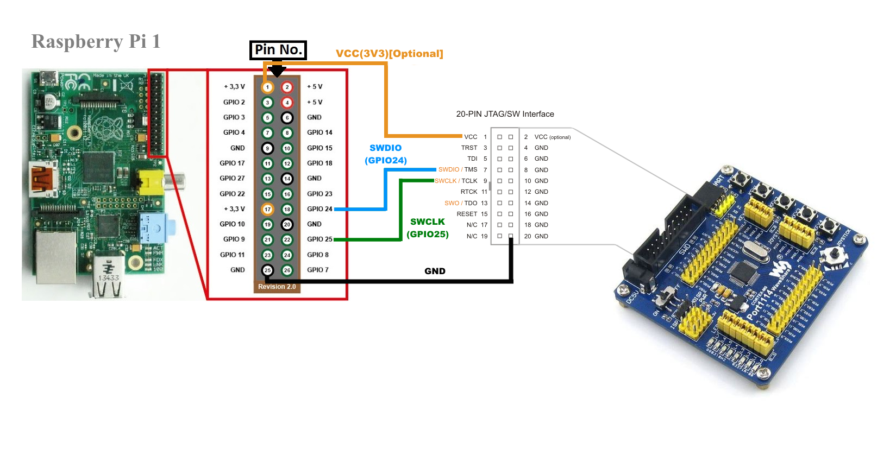
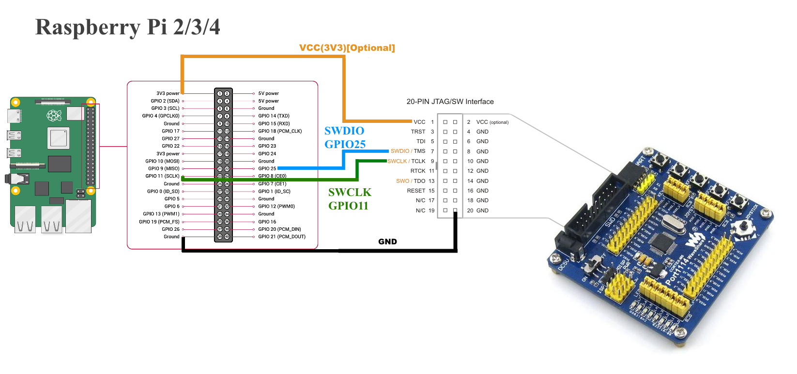
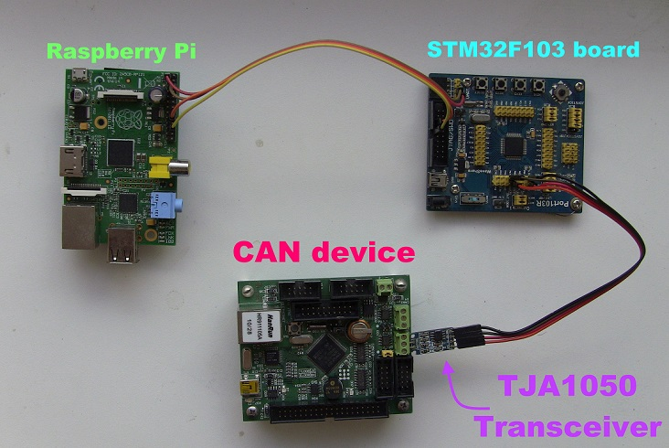

# REMCU examples for STM32F103 board
## Overview

These simple examples demonstrate how to easily expand hardware of a Raspberry Pi board using one dollar STM32 microcontroller and some wires.  
The C++ applications and Python scripts ran Raspberry will gain access to internal STM32F103 peripheral modules like DAC, ADC, DMA, GPIO and others as if these peripherals were a part of Raspberry chip. Without a microcontroller firmware development and a kernel driver just with help [**REMCU Library**](https://remotemcu.com/).

There are also [Jupyter Notebook](https://jupyter.org/) scripts for running on PC(MacOS, Linux, Windows)

To interact with a microcontroller hardware from our PC we use the driver functions of [Standard Peripheral Library for STM32F10x line](https://www.st.com/content/st_com/en/products/embedded-software/mcu-mpu-embedded-software/stm32-embedded-software/stm32-standard-peripheral-libraries/stsw-stm32054.html) of STMicroelectronics company. It is a vendor software development kit provided by STMicroelectronics company for a firmware development of STM32 MCU.
Our application calls these driver functions, just like calls them for hardware operations from firmware code.

The code controlling MCU peripheral module have been taken from  [example](STM32F10x_StdPeriph_Lib_V3.5.0/Project/STM32F10x_StdPeriph_Examples) of [Standard Peripheral Library for STM32F10X](https://www.st.com/content/st_com/en/products/embedded-software/mcu-mpu-embedded-software/stm32-embedded-software/stm32-standard-peripheral-libraries/stsw-stm32054.html)

## Table of Contents
1. [Raspberry Pi](#1-raspberry-pi)
   + [C++ programs](#C++-programs)
   + [Python scripts](#Python-scripts)
2. [MacOS/Linux](#2-macoslinux)
3. [Windows](#3-windows)

## 1. Raspberry Pi

A video tutorial on how to build and run these examples on Raspberry Pi computer:

[](https://youtu.be/JdBabbC5Prk)

### Prerequirements
 * A [Raspberry Pi v1](https://www.raspberrypi.org/products/raspberry-pi-1-model-b-plus/) board
 * A board with the STM32F103 high-density device. There are demonstration on [Port103R](https://www.google.com/search?q=port103r) board.
 * 4 wires to connect Pi with MCU
 * An oscilloscope to display analog signals. It is optional.
 * A specify [***image***](https://remotemcu.com//images/2020-05-27-raspberry-remcu.zip) of Raspberry containing these examples,  prebuild OpenOCD utility and REMCU library  
  or install/download these components to your Raspbian filesystem manually. [Instructions](#manual-configuration-installation-all-necessary-components)

### Prepare
#### Using the image
Download the [***image***](https://remotemcu.com//images/2020-05-27-raspberry-remcu.zip) and unpack the archive. Write the image to your SD card using the official Raspberry Pi [documentation](https://www.raspberrypi.org/documentation/installation/).  
[](https://www.youtube.com/watch?v=CCRVo5sI1E0)  
Insert the card into the board and switch Raspberry Pi on.  Connect a keyboard and a monitor or connect using SSH. By default, the system has a ***static IP address 192.168.0.10***. The default login is ‘pi’ and the default password is ‘raspberry’. Home directory has everything necessary to build and run the examples.  
This image has a community version of the REMCU lib which works through debug interface and requires an OpenOCD utility. Connect this Raspberry GPIO pins to debug port of the MCU using scheme below.  
<details>
  <summary>scheme
<b>(click here) </b></summary>



</details>


Run the “openocd.sh” scripts:  
<details>
  <summary> OpenOCD result
<b>(click here) </b></summary>


</details>


Navigate to ‘examples’ directory and run ‘make’ command. Several applications were created.  
<details>
  <summary> "make" result
<b>(click here) </b></summary>


</details>

#### Manual configuration. Installation all necessary components
That requires next:  
1. Downlaod prebuild OpenOCD from [here](https://github.com/remotemcu/Raspbian_packages) to your Raspbian RootFS. The build have been tested on Raspberry Pi and we recommend it.

```bash
git clone https://github.com/remotemcu/Raspbian_packages.git
```

Connect this Raspberry GPIO pins to debug port of the MCU using [scheme above](img/scheme.png) and run OpenOCD utility

```bash
cd Raspbian_packages/
./openocd.sh
```

Another way you can install OpenOCD(version 0.10 or higher) from Raspbian's repo:  

```bash
sudo apt-get install openocd
```

In this case, run OpenOCD utility this way:  

```bash
sudo openocd -f interface/raspberrypi-native.cfg -c "transport select swd" -f target/stm32f1x.cfg
```

>More information about Rpi connection with MCU using OpenOCD can be found here:
https://learn.adafruit.com/programming-microcontrollers-using-openocd-on-raspberry-pi
or
https://iosoft.blog/2019/01/28/raspberry-pi-openocd/

2. Download these examples to Raspberry RootFS and go to STM32F103RCT6 directory

```bash
 git clone https://github.com/remotemcu/remcu_examples/
 cd STM32F103RCT6/
```

3. Download REMCU Lib archive from [**download page**](https://remotemcu.com/download):  
Target - **STM32F10X_HD**  
Library - **StdPeriph_Lib**  
Version - **V3.5.0**  
Operation system - **Raspbian**

<details>
  <summary>download page
  <b>(click here) </b></summary>
  
 
</details>

4. Extract it to the example folder

```bash
$pwd 
..../STM32F103RCT6/
$tar -xf remcu-*.tar
```


### C++ programs
The TriangleWave app is the slightly modified [TwoChannels_TriangleWave](STM32F10x_StdPeriph_Lib_V3.5.0/Project/STM32F10x_StdPeriph_Examples/DAC/TwoChannels_TriangleWave/main.c) sample of Standard Peripheral Library which  generates a triangle signal using DAC and built-in generator. You can specify the signal period in cycles  using the startup arguments.  
Connect the probe to the PA4 pin. The Oscilloscope shows a triangle wave.  
<details>
  <summary>
wave <b>(click here) </b></summary>

 
</details>
 
Try to change the period. The signal frequency also has changed!  
<details>
  <summary>wave 
<b>(click here) </b></summary>


</details>


The second app is ***DAC_DMA_Escalator*** that generates an escalator signal. The DAC module of STM32 MCU doesn’t have this signal generator. But the wave can be created by using both DAC and DMA.  
A DMA enables buffering received and transmitted data from peripherals to the MCU's memory. And the REMCU library can load and store to the microcontroller memory.  
  
In this way, you can upload signal data to the MCU chip memory and control DAC using DMA.  
The code of this application was taken from the [OneChannelDMA_Escalator](STM32F10x_StdPeriph_Lib_V3.5.0/Project/STM32F10x_StdPeriph_Examples/DAC/OneChannelDMA_Escalator/main.c) sample of SPL. You can specify the signal period in cycles using the startup arguments.  
Run the app! The oscilloscope shows an escalator wave. 
<details>
  <summary>
wave <b>(click here) </b></summary>

 
</details>
Let’s try to change the period. As you can see, the signal frequency has also changed!  
<details>
  <summary>
wave <b>(click here) </b></summary>

 
</details>

A small application ADC_line receives the ADC data and builds a horizontal bar chart  based on this value. Plug a variable resistor into the PC4 pin and run the application.  
<details>
  <summary> show 
<b>(click here) </b></summary>


</details>

Rotate the shaft and you will get the voltage versus time chart.  
<details>
  <summary>
<b>show(click here) </b></summary>

  
</details>

There are two examples to work with CAN bus, *CAN_send* and *CAN_receiver*. These examples work on 125 kBps. For other baud rates and this clock configuration(see system_stm32f10x.c), the CAN Initialization code (Prescaler value) should be amended accordingly:  
```cpp
  //CAN_InitStructure.CAN_Prescaler = 4*16; //Prescaler for 62.5 kBps
  CAN_InitStructure.CAN_Prescaler = 4*8; //Prescaler for 125 kBps
  //CAN_InitStructure.CAN_Prescaler = 4*4; //Prescaler for 250 kBps
  //CAN_InitStructure.CAN_Prescaler = 4*2; //Prescaler for 500 kBps
  //CAN_InitStructure.CAN_Prescaler = 4*1; //Prescaler for 1 MBps
```
Build CAN network like this:  
<details><summary>
show(<b>click here</b>) </summary>




</details>

The *CAN_receiver* is a simple app that captures all CAN bus messages on the bus. Just run *CAN_receiver* app and look at the results:  
<details><summary>
show(<b>click here</b>) </summary>


</details>

The *CAN_send* is a simple app that send one message obtained through the program arguments. Example of using:  
<details><summary>
show(<b>click here</b>) </summary>


</details>

> Note that we didn’t develop the MCU firmware. Our Linux program directly works with ADC, DAC, DMA, CAN and RAM modules using a remote procedure execution of the Standard Peripheral Library.  
<details><summary>
show(<b>click here</b>) </summary>


</details>

### Python scripts

You can use the ReMCU library not only in the C/C++ program on the Raspberry Pi board. Alternatively, you can call ReMCU library functions using other programming languages. As Python is an official recommended programming language of Raspberry, let’s see some Python examples. To make working with them less troublesome, we provide language wrappers(**STM32F10X_HD_StdPeriph_Lib.py**).
 With these wrappers it becomes easy to work with hardware as it is using C or C++.  
 <details>
  <summary>
Examples: <b>Python and C/C++(click here) </b></summary>


</details>
  

  * **gpio .py** script  toggles the PB12 MCU pin. Just execute it:  
<details><summary>
Show <b>(click here) </b></summary>


</details>
  
```bash
python gpio.py
```
  * **ADC_line.py** script builds a horizontal bar chart of the ADC value versus time like the *C* ADC_line application.
<details>
  <summary>
	<b>show(click here) </b></summary>

  
</details>


The ReMCU library can be ported to any version of the Raspberry Pi board and also on far less powerful and much more powerful embedded platforms  


## 2. MacOS/Linux
### Prerequirements
 * A board with the STM32F103 high-density device. There are demonstration on [Port103R](https://www.google.com/search?q=port103r) board.
 * A debugger like st-link or jlink
 * Debug server. It can be an OpenOCD([prebuild package](https://github.com/ilg-archived/openocd/releases/tag/v0.10.0-12-20190422)) or st-link GDB server from [Atollic TrueStudio](https://atollic.com/truestudio/) or [Jlink GDB server](https://www.segger.com/products/debug-probes/j-link/tools/j-link-gdb-server/about-j-link-gdb-server/) (if you use jlink instead of st-link)
 * [Anaconda Distribution](https://www.anaconda.com/distribution/), ***we recommend Python 2 version***

### Prepare
Download the example. Download the necessary version of REMCU Lib from [**download page**](https://remotemcu.com/download):  
Target - **STM32F10X_HD**  
Library - **StdPeriph_Lib**  
Version - **V3.5.0**  
Operation system - **MacOS/Linux**

  
Extract the library to this folder.  
Build examples, just  ***make*** command:  
<details>
  <summary> show
	<b>(click here) </b></summary>

  
</details>

Connect the STM32 board with debugger to PC:  


Run OpenOCD with arguments above:

  + st-link debugger
```bash 
./openocd -f interface/stlink-v2.cfg -f target/stm32f1x.cfg
```
<details>
  <summary>Success result for openocd
	<b>(click here) </b></summary>


</details>

#### Running...
There are the same programs and python scripts as above in the Raspberry part. You can see their description there.

#### Jupyter Notebook
If you ever wish to conduct a quick experiment with any chip peripheral module or explore it, then REMCU is the right tool for that. It can be easily integrated in [Jupyter Notebook](https://jupyter.org/) with an Interactive [C++ interpreter](https://github.com/root-project/cling) . This IDE is free and it lets you run and execute C or C++ code on the go. This way you can call the functions of a driver directly and control MCU or SoC in real time.  
It saves a lot of time that is usually spent on the development of experimental MCU firmware. An interact work with MCU/SoC peripherals helps us to explore new peripheral blocks of MCU/SoC quicker.  
And furthermore, the application code written in the C programming language using REMCU is backwards-portable, meaning it can be transferred from a desktop program to the MCU program and vice-versa. The code will work just as fine on MCU as it works on PC. That's why code written on desktop with ReMCU can be used to develop stand-alone firmware for MCU.  

[**REMCU tutorial**](https://youtu.be/iuofdoWWkC4) can help you run these notebooks.

 * **Cpp_Examples.ipynb** is a C++ script for Jupyter Notebook.  

Install [**Anaconda Distribution**](https://www.anaconda.com/distribution/). Run Anaconda Navigator and install [**xeus-cling**](https://github.com/jupyter-xeus/xeus-cling) and [**xplot**](https://github.com/QuantStack/xplot) packages.  
<details>
  <summary> Installed packages
	<b>(click here) </b></summary>


</details>
Run Jupyter Notebook and open the *Cpp_Examples.ipynb* file in it. The script contains detailed comments for work. You just do step by step code of the script and observe the results.  
<details>
  <summary>
	ADC graph<b>(click here)</b></summary>
	
  
</details>

## 3. Windows
Unfortunately, C++ [Cling](https://github.com/root-project/cling) interpreter is only available for Unix-like system (***MacOS*** and ***Linux***).  
But there is possible to use the REMCU with high level languages like Python, Java, C# and others.

***Python_Examples.ipynb*** sample demonstrates work with REMCU lib in Windows using Python interpreter.

[**REMCU tutorial**](https://youtu.be/iuPJtNPQ9iA) can help you run these notebooks.

### Prerequirements
 * A board with the STM32F103 high-density device. There are demonstration on [Port103R](https://www.google.com/search?q=port103r) board.
 * A debugger like st-link or jlink
 * Debug server. It can be an OpenOCD([prebuild package](https://github.com/ilg-archived/openocd/releases/tag/v0.10.0-12-20190422)) or st-link GDB server from [Atollic TrueStudio](https://atollic.com/truestudio/) or [Jlink GDB server](https://www.segger.com/products/debug-probes/j-link/tools/j-link-gdb-server/about-j-link-gdb-server/) (if you use jlink instead of st-link)
 * [Anaconda Distribution](https://www.anaconda.com/distribution/), ***we recommend Python 2 version***

### Prepare
Download the example. Download the necessary version of REMCU Lib from [**download page**](https://remotemcu.com/download):  
Target - **STM32F10X_HD**  
Library - **StdPeriph_Lib**  
Version - **V3.5.0**  
Operation system - **Windows**

  
Extract the library to this folder.  

Connect the STM32 board with debugger to PC:  
<details>
  <summary>diagram
	<b>(click here) </b></summary>


</details>
Run OpenOCD with arguments above:

  + st-link debugger
```bash 
openocd.exe -f interface/stlink-v2.cfg -f target/stm32f1x.cfg
```


Install the [Anaconda Distribution](https://www.anaconda.com/distribution/) and [ipywidgets](https://ipywidgets.readthedocs.io/en/stable/user_install.html) package. ***We encourage you use Python 2 version***. We can not guarantee the work of the script with Python 3.  
Run Jupyter Notebook and open the Python_Examples.ipynb file in it.  
The script contains detailed comments for work. You just do step by step code of the script and observe the results.  


