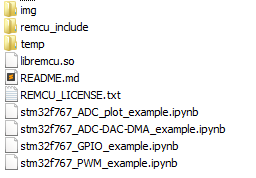
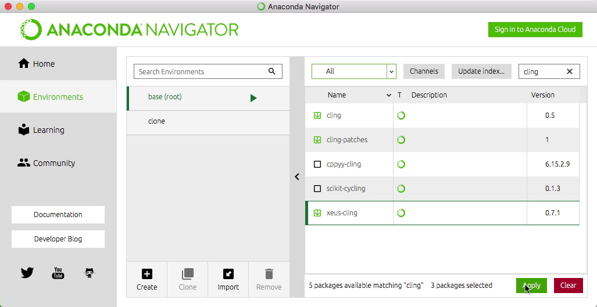
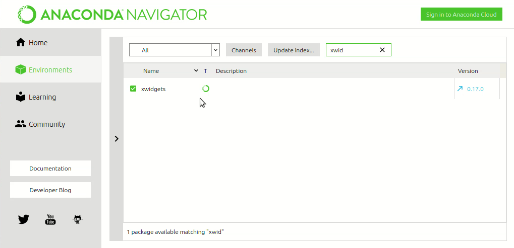

# Jupyter Notebook Examples

## Overview
If you ever wish to conduct a quick experiment with any chip peripheral module or explore it, then [**REMCU Lib**](https://remotemcu.com/) is the right tool for that. It can be easily integrated in [Jupyter Notebook](https://jupyter.org/) with an Interactive C++ interpreter . This IDE is free and it lets you run and execute C or C++ code on the go. This way you can call the functions of a driver directly and control MCU or SoC in real time.  
It saves a lot of time that is usually spent on the development of experimental MCU firmware. An interact work with MCU/SoC peripherals helps us to explore new peripheral blocks of MCU/SoC quicker.  
And furthermore, the application code written in the C programming language using REMCU is backwards-portable, meaning it can be transferred from a desktop program to the MCU program and vice-versa. The code will work just as fine on MCU as it works on PC. That's why code written on desktop with ReMCU can be used to develop stand-alone firmware for MCU.  
There is also possible to use the REMCU with high level languages like Python, Java, C# and others.  To make working with them less troublesome, we provide language wrappers. With these wrappers it becomes easy to work with hardware as it is using C or C++.

*These examples demonstrates how to easily use REMCU Lib with C++ ([Cling](https://github.com/root-project/cling)) interpreter.*

## Prerequirements
  * An [STM32F767 board](img/f7board.jpg)
  * PC with MacOS or Linux(Ubuntu recommended)
  * An oscilloscope to watch DAC signal. It is optional.
  * [Anaconda Distribution](https://www.anaconda.com/distribution/), ***we recommend Python 2 version***
  * A debug server. It can be an OpenOCD([prebuild package](https://github.com/ilg-archived/openocd/releases/tag/v0.10.0-12-20190422))

## Prepare

Install the [Anaconda Distribution](https://www.anaconda.com/distribution/) 

Download the example. Download the necessary version of REMCU Lib from [**download page**](https://remotemcu.com/download):  
Target - **STM32F767xx**  
Library - **LowLayer_HAL_drivers**  
Version - **1.16.0**  
Operation system - **your OS**

  
download show<b>(click here) </b>

  

Extract the library to this folder. 

  
show <b>(click here)</b>

  

Connect the Discovery board to your PC, then

## C++ script
C++ [Cling](https://github.com/root-project/cling) interpreter is only available for Unix-like system (***MacOS*** and ***Linux***). Run Anaconda Navigator and install [**xeus-cling**](https://github.com/jupyter-xeus/xeus-cling), [**xwidgets**](https://github.com/jupyter-xeus/xwidgets) and [**xplot**](https://github.com/QuantStack/xplot) packages.  

  
xeus install show
<b>(click here) </b>

Run Jupyter Notebook and open the **stm32f767_GPIO_example.ipynb** or **stm32f767_PWM_example.ipynb** or **stm32f767_ADC-DAC-DMA_example.ipynb** file in it. The script contains detailed comments for work. You just do step by step code of the script and observe the results.  

Description of REMCU functions can be found can be found in [API reference](https://remotemcu.com/api-v1-0)  
Code controlling MCU peripherals have been taken from Examples_LL of [HAL for STM32F7](https://github.com/STMicroelectronics/STM32CubeF7/tree/master/Projects/STM32F767ZI-Nucleo/Examples_LL/).

  
Result <b>(click here)</b>

  
[video](img/demo_examples.mp4)

